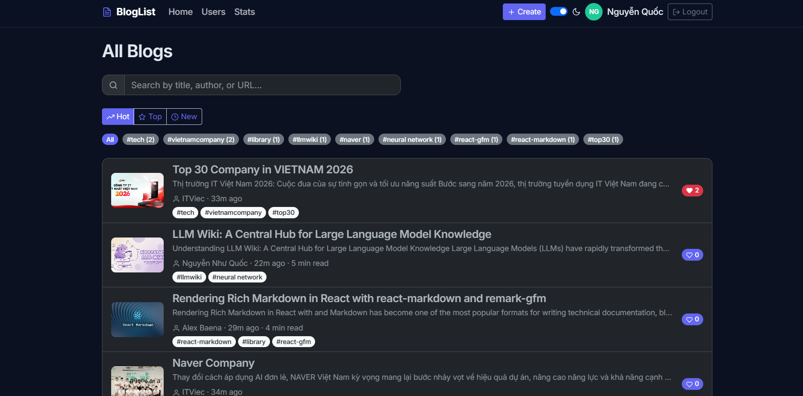
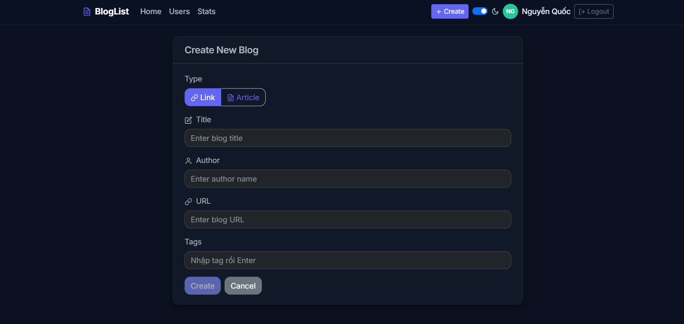

<div align="center">

# Bloglist

**A full-stack blogging & bookmarking platform — bookmark links with auto-generated previews, or publish Markdown articles, then like, comment, tag, and rank them.**

[](https://bloglist-reactapp.onrender.com)
[](https://github.com/Ngnquoc1/BlogList_ReactApp/actions/workflows/ci.yml)


[Live demo](https://bloglist-reactapp.onrender.com) · [Report a bug](https://github.com/Ngnquoc1/BlogList_ReactApp/issues) · [Request a feature](https://github.com/Ngnquoc1/BlogList_ReactApp/issues)

</div>

---

## Table of Contents

- [Overview](#overview)
- [Features](#features)
- [Security](#security)
- [Tech Stack](#tech-stack)
- [Architecture](#architecture)
- [Getting Started](#getting-started)
- [Environment Variables](#environment-variables)
- [Scripts](#scripts)
- [API Reference](#api-reference)
- [Testing](#testing)
- [Deployment](#deployment)
- [Roadmap](#roadmap)
- [License](#license)
- [Author](#author)

---

## Overview

Bloglist is a hybrid content platform in the spirit of Dev.to and Hacker News. Every post is one of two types:

- **Link** — paste a URL and the server scrapes its Open Graph metadata into a rich preview card.
- **Article** — write a post in Markdown, with a live preview editor, optional cover image, and automatic reading-time.

Both types share one feed that users can search, filter by tag, and rank by **Hot**, **Top**, or **New**.

> **Live demo:** https://bloglist-reactapp.onrender.com
> Hosted on Render's free tier — the first request after a period of inactivity may take ~30–50s to wake the server.

<!-- Replace with real screenshots in docs/screenshots/ -->

|             Feed              |               Article               |              Create               |
| :---------------------------: | :---------------------------------: | :-------------------------------: |
|  |  |  |

---

## Features

**Content**

- Link bookmarks with automatic Open Graph previews (title, description, image, site name).
- Markdown articles with a Write/Preview editor (`react-markdown` + `remark-gfm`), optional cover image, reading-time, and auto-generated excerpts.

**Engagement**

- Per-user likes — one like per user, toggle on/off.
- Comments with author, timestamp, and owner-only delete.

**Discovery**

- Full-text search across title, author, and URL.
- Tagging with click-to-filter.
- Three feed-ranking modes: **Hot** (likes + recency), **Top** (most liked), **New** (newest first).

**Accounts & UX**

- Sign up / log in with JWT; protected routes; automatic logout on token expiry.
- System-aware dark / light theme with no flash on first paint.
- Optimistic UI — likes and comments apply instantly and roll back on error.

---

## Security

- **JWT + bcrypt** authentication; passwords are never stored in plaintext.
- **Helmet** with a tailored Content-Security-Policy.
- **Rate limiting** on `POST /login` (10 / 15 min) and `POST /users` (5 / hr) to slow brute-force and signup spam.
- **NoSQL-injection guards** — credentials are type-checked so a payload like `{"username": {"$ne": null}}` can't reach the database query.
- **CORS closed by default** — the API and SPA are same-origin; cross-origin access is opt-in via `CORS_ORIGIN`.
- **XSS-safe Markdown** — `react-markdown` renders without raw HTML (`rehype-raw` is not enabled).
- **Whitelist sanitization** on writes prevents mass-assignment; ownership is enforced on every update and delete.

---

## Tech Stack

| Layer          | Technologies                                                                                                                                                                    |
| :------------- | :------------------------------------------------------------------------------------------------------------------------------------------------------------------------------ |
| **Frontend**   | React 18, Vite 6, TanStack Query v5, Zustand, React Context, React Router v7, React-Bootstrap / Bootstrap 5, Framer Motion, react-markdown + remark-gfm, react-hot-toast, Axios |
| **Backend**    | Node.js, Express 4, MongoDB + Mongoose 8, JSON Web Token, bcrypt, open-graph-scraper, Helmet, express-rate-limit                                                                |
| **Testing**    | Jest + Supertest (API), Playwright (E2E)                                                                                                                                        |
| **Deployment** | Render — a single web service where Express serves the built frontend                                                                                                           |

---

## Architecture

```
Bloglist/
├─ backend/                 Express API that also serves the built frontend
│  ├─ controller/           route handlers: blogs, users, login
│  ├─ models/               Mongoose schemas: Blog, User
│  ├─ utils/                middleware, validation, config, rateLimit, linkPreview
│  └─ tests/                Jest + Supertest API tests
├─ frontend/
│  └─ src/
│     ├─ api/               Axios instance + one module per resource
│     ├─ hooks/queries/     TanStack Query hooks (one per query/mutation)
│     ├─ context/           AuthContext, ThemeContext
│     ├─ stores/            Zustand UI store
│     ├─ pages/             route-level components
│     ├─ components/        layout / ui / blog
│     └─ utils/             blogHelpers, validation
└─ test/                    Playwright end-to-end tests
```

**State is split by ownership.** Server data (blogs, users, comments) lives in **TanStack Query**, which owns caching, refetching, and optimistic updates. Shared client state that must survive navigation (search text, active tag, feed sort) lives in **Zustand**. Auth and theme live in **React Context**. Provider order: `Router → QueryClient → Theme → Auth`.

**The Axios instance owns auth plumbing.** A request interceptor injects the JWT; a response interceptor catches `401` and forces logout + redirect — so no component has to reason about token expiry.

**Hybrid content without a migration.** Each blog carries `type: "link" | "article"` (default `"link"`). Articles were added by branching on `type`; existing documents stayed valid because `url` is only conditionally required (`required: () => this.type === "link"`).

**Link previews are scraped server-side** — browsers can't fetch a third-party page's HTML (CORS), and the server can enforce timeouts. A failed scrape never blocks blog creation; the preview is simply omitted.

**The feed ranks with a gravity formula**, in the spirit of Hacker News:

```
score = (likes + 1) / (ageInHours + 2) ^ 1.5
```

---

## Getting Started

### Prerequisites

- Node.js 18+
- A MongoDB database (e.g. [MongoDB Atlas](https://www.mongodb.com/atlas))

### Installation

```bash
git clone https://github.com/Ngnquoc1/BlogList_ReactApp.git
cd BlogList_ReactApp
```

**Backend**

```bash
cd backend
cp .env.example .env      # then fill in the values
npm install
npm run dev               # http://localhost:3001
```

**Frontend** (in a second terminal)

```bash
cd frontend
npm install
npm run dev               # http://localhost:5173, proxies /api to the backend
```

---

## Environment Variables

Create `backend/.env` from `backend/.env.example`:

| Variable           | Required  | Description                                                                                            |
| :----------------- | :-------: | :----------------------------------------------------------------------------------------------------- |
| `MONGODB_URI`      |    ✅     | MongoDB connection string                                                                              |
| `SECRET`           |    ✅     | Key used to sign JWTs — use a long random string                                                       |
| `TEST_MONGODB_URI` | for tests | A **separate** database for the test suite (it deletes every document). Must differ from `MONGODB_URI` |
| `PORT`             |     —     | API port (defaults to `3003`; `.env.example` uses `3001`)                                              |
| `CORS_ORIGIN`      |     —     | Comma-separated allowed origins; only needed when the frontend runs on a different origin              |

> `.env` is git-ignored — never commit real secrets.

---

## Scripts

**backend/**

| Script               | Description                                               |
| :------------------- | :-------------------------------------------------------- |
| `npm run dev`        | Start with auto-reload                                    |
| `npm start`          | Start in production mode                                  |
| `npm test`           | Run the Jest + Supertest API tests                        |
| `npm run start:test` | Start in test mode (enables `/api/testing/reset` for E2E) |
| `npm run build:ui`   | Build the frontend and copy it into `backend/dist`        |

**frontend/**

| Script          | Description                           |
| :-------------- | :------------------------------------ |
| `npm run dev`   | Vite dev server                       |
| `npm run build` | Production build into `frontend/dist` |
| `npm run lint`  | Run ESLint                            |

---

## API Reference

All routes are prefixed with `/api`. Endpoints marked 🔒 require an `Authorization: Bearer <token>` header.

| Method   | Endpoint                         | Description                                 |
| :------- | :------------------------------- | :------------------------------------------ |
| `GET`    | `/blogs`                         | List all blogs                              |
| `GET`    | `/blogs/:id`                     | Get one blog with populated comment authors |
| `POST`   | `/blogs`                         | 🔒 Create a link or article                 |
| `PUT`    | `/blogs/:id`                     | 🔒 Update — owner only                      |
| `DELETE` | `/blogs/:id`                     | 🔒 Delete — owner only                      |
| `PUT`    | `/blogs/:id/like`                | 🔒 Toggle your like                         |
| `POST`   | `/blogs/:id/comments`            | 🔒 Add a comment                            |
| `DELETE` | `/blogs/:id/comments/:commentId` | 🔒 Delete a comment — author only           |
| `GET`    | `/users`                         | List users with their blogs                 |
| `POST`   | `/users`                         | Register a new account                      |
| `POST`   | `/login`                         | Authenticate, returns a JWT                 |

---

## Testing

The repository contains an API suite (Jest + Supertest) and an end-to-end suite (Playwright). Every push and pull request runs the API tests and a frontend lint + build through [GitHub Actions](.github/workflows/ci.yml).

**API tests** run against an isolated database — the app refuses to start under `NODE_ENV=test` unless a distinct `TEST_MONGODB_URI` is set, so tests can never touch production data.

```bash
cd backend
npm install
npm test        # 24 tests across blogs and users endpoints
```

**End-to-end** drives the backend in test mode (which exposes `/api/testing/reset`) and loads the app from the built frontend:

```bash
cd backend && npm run build:ui && npm run start:test   # terminal 1
cd test && npm install && npx playwright install && npm test
```

> **Status:** the API suite is green in CI. The end-to-end specs predate the current UI redesign and are being updated to match it — see the [roadmap](#roadmap).

---

## Deployment

Deployed to **Render** as a single web service: the build compiles the frontend and copies it into `backend/dist`, which Express serves alongside the API — so the frontend's `/api` calls stay same-origin.

| Setting        | Value                                                                                                                          |
| :------------- | :----------------------------------------------------------------------------------------------------------------------------- |
| Root directory | `backend`                                                                                                                      |
| Build command  | `npm install && cd ../frontend && npm install && npm run build && cd ../backend && rm -rf dist && cp -r ../frontend/dist dist` |
| Start command  | `npm start`                                                                                                                    |
| Environment    | `MONGODB_URI`, `SECRET` (Render provides `PORT`)                                                                               |

MongoDB Atlas must allow Render's IPs — on the free tier, allow `0.0.0.0/0` under Network Access.

---

## License

Released under the MIT License.

## Author

**Nguyen Nhu Quoc** — [GitHub](https://github.com/Ngnquoc1)
